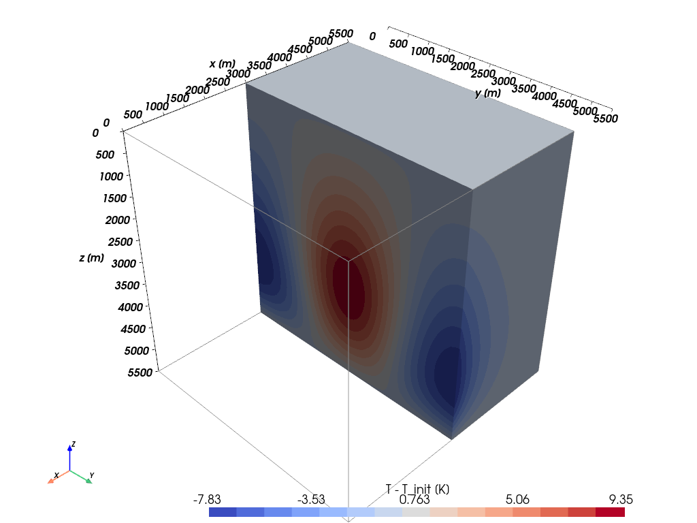

# Convection along Fault Planes

The benchmark model from 
- Magri, F., Cacace, M., Fischer, T., Kolditz, O., Wang, W., & Watanabe, N. (2017). Thermal convection of viscous fluids in a faulted system: 3D benchmark for numerical codes. Energy Procedia, 125, 310–317. https://doi.org/10.1016/j.egypro.2017.08.204

is extended to investigate the factors influencing convection-induced thermal anomalies along fault planes. The benchmark model looks like this:

This project aims to create a surrogate model for a 3D cube containing a fault. The simulations are exported from COMSOL and stored in the "Snapshots" folder. Each subdirectory is labeled with a number (e.g., "01"), corresponding to a specific version or parameter space, which is detailed in the respective `training_samples.csv`.

The scripts for performing NIRB can be found in the "Surrogate_Nirb" folder. Each script contains an alphabetical prefix that denotes its chronological order. In general, `*.py` files are used for calculations and computations, while `*.ipynb` files are used for quality checks and plotting.

### A - Sampling
This script defines the parameter space, specifying which parameters can vary in the surrogate model and their respective ranges. The samples are exported as CSV files using the `pint` package, an elegant tool for unit handling.

### B - Loop (Generating Snapshots)
This script is intended for use on computers where the COMSOL solver is available. It loads the parameters from the CSV file, inserts them into the COMSOL model, and then runs the simulation. The results are saved as `.vtu` files.

### C - Quality Check
This step extracts data from the `.vtu` files and merges it into `.npy` files. Additionally, plots and movies are generated to visualize and verify the simulations.

### D - POD 
This step involves applying Proper Orthogonal Decomposition (POD) to the simulation data.

### E - Coefficient Model
In this step, a machine learning model is created using the `Lightning` library to estimate the coefficients for each basis function.
